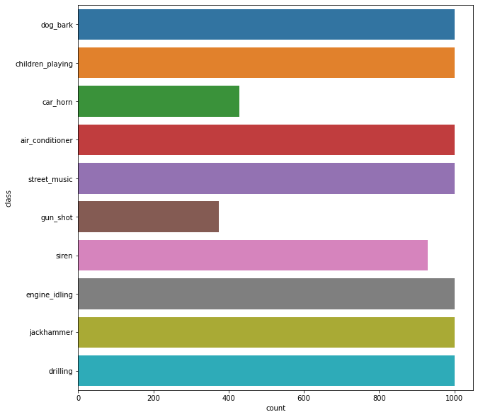

# **UrbanSound8K**

## **Description**

This dataset contains 8732 labeled sound excerpts (<=4s) of urban sounds from 10 classes: air_conditioner, car_horn, 
children_playing, dog_bark, drilling, engine_idling, gun_shot, jackhammer, siren, and street_music. The classes are 
drawn from the urban sound taxonomy described in the following article, which also includes a detailed description of 
the dataset and how it was compiled:

*J. Salamon, C. Jacoby and J. P. Bello, "A Dataset and Taxonomy for Urban Sound Research", 
22nd ACM International Conference on Multimedia, Orlando USA, Nov. 2014.*

There is a very famous dataset to practice deep learning methods on sounds. You can reach the data from the link below:

https://urbansounddataset.weebly.com/urbansound8k.html

### **Dataset**

**Audio Files Included**

* 8732 audio files of urban sounds (see description above) in WAV format. The sampling rate, bit depth, and number of 
channels are the same as those of the original file uploaded to Freesound (and hence may vary from file to file).

**Meta-data Files Included**

* UrbanSound8k.csv

* This file contains meta-data information about every audio file in the dataset. This includes:

	$\star$   **slice_file_name:** 

	$\star$   **fsID:** The Freesound ID of the recording from which this excerpt (slice) is taken

	$\star$   **start:** The start time of the slice in the original Freesound recording

	$\star$   **end:** The end time of slice in the original Freesound recording

	$\star$   **salience:** A (subjective) salience rating of the sound. 1 = foreground, 2 = background.

	$\star$   **fold:** The fold number (1-10) to which this file has been allocated.
  
	$\star$   **classID:** A numeric identifier of the sound class:
0 = air_conditioner
1 = car_horn
2 = children_playing
3 = dog_bark
4 = drilling
5 = engine_idling
6 = gun_shot
7 = jackhammer
8 = siren
9 = street_music

	$\star$  **class:** The class name: air_conditioner, car_horn, children_playing, dog_bark, drilling, engine_idling, gun_shot, jackhammer, 
siren, street_music.

📌 When we look at the urban data we have much less audio data with gun shot and car horn this can affect model to predict those two classes more poorly than other classes. Maybe we can try to add augmented data for those classes after seeing the result of model. Now lets listen some of the audio examples.
